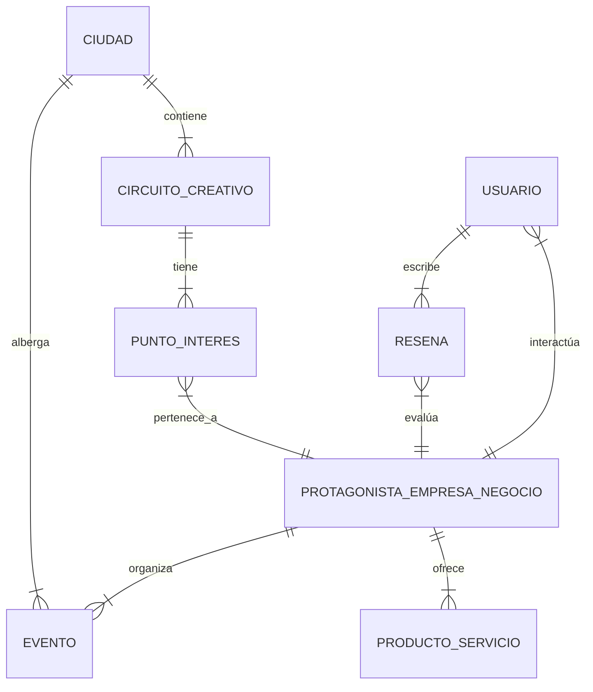

# Contexto del Proyecto: Circuitos Creativos de Nicaragua (Hackathon)

Este documento centraliza toda la información técnica, contextual, objetivos y modelo de datos para el desarrollo del proyecto en el marco del Hackathon.

---

## 1. Información del Reto

* **Temática:** Ciudades Creativas y Tecnológicas
* **Nombre del reto:** Circuitos Creativos de la Red Nacional de Ciudades Creativas
* **Descripción del problema / necesidad:**  
  Se requiere conectar a las Ciudades Creativas de Nicaragua con el mundo, dar a conocer mapas interactivos que recorren los circuitos creativos, experiencias inmersivas para localizar, conocer y compartir riqueza histórica, natural, saberes populares, culturales y tradicionales de nuestro pueblo; agenda de actividades como presentaciones, talleres, ferias, expo-ventas.
* **Usuarios objetivo:**  
  Turistas nacionales y extranjeros, protagonistas de las industrias creativas y culturales que ofertan productos y servicios en las Ciudades Creativas.
* **Contexto del reto (10 Ciudades Creativas de la Red Nacional):**  
  1. Estelí
  2. León
  3. Nagarote
  4. Managua
  5. Masaya
  6. Granada
  7. San Juan de Oriente
  8. Juigalpa
  9. Matapalpa (Matagalpa)
  10. Bluefields
* **Situación Actual:**  
  Las Ciudades Creativas requieren aprovechar la tecnología, dada la habilitación de Circuitos Creativos, generando mayor afluencia del turismo nacional e internacional y mayor demanda de los productos y servicios emblemáticos de las Ciudades Creativas.
* **Impacto esperado para la comunidad:**  
  Mayor divulgación, promoción y posicionamiento en el turismo internacional, dinamismo económico en las Ciudades Creativas generado por el turismo, nuevas oportunidades para protagonistas emprendedores y MiPymes.

---

## 2. Objetivos del Proyecto (Transcripción de Notas Manuscritas)

1. **Plataforma Multiplataforma (Móvil / Web):**  
   Construir una plataforma móvil/web que permita a los usuarios visualizar información, datos, eventos, fiestas tradicionales, etc., de las ciudades más importantes de Nicaragua.
2. **Conexión y Publicidad para Empresas Locales:**  
   Conectar a empresas locales para que muestren publicidad sobre sus sitios turísticos, detallando específicamente la oferta de sus productos y servicios.
3. **Atracción de Inversión Estratégica:**  
   Mostrar lugares y empresas donde personas o inversionistas extranjeros puedan hacer inversión, promoviendo el crecimiento económico local de estas ciudades.

---

## 3. Modelo de Datos (Diagrama Entidad-Relación Manuscrito)

A partir de la estructura del diagrama de base de datos elaborado a mano:

### Detalle de Entidades e Interconexiones:

* **`Ciudad`**: Representa las 10 Ciudades Creativas de Nicaragua. Se vincula con sus circuitos creativos y con los eventos locales.
* **`Circuito_Creativo`**: Agrupa rutas turísticas y culturales dentro de cada ciudad. Se compone de varios puntos de interés (`Punto_interes`).
* **`Punto_interes`**: Puntos en el mapa interactivo asociados a un circuito creativo y pertenecientes a un protagonista/negocio local.
* **`Protagonista_empresa_negocio`**: Protagonistas de industrias creativas y culturales (empresas/negocios locales). Ofrecen productos o servicios, organizan eventos y reciben reseñas.
* **`Producto_o_Servicio`**: Catálogo comercial ofrecido por cada empresa o protagonista.
* **`Evento`**: Actividades de la agenda (ferias, talleres, exposiciones, fiestas tradicionales).
* **`Usuario`**: Turistas nacionales/extranjeros o usuarios del sistema.
* **`Reseña`**: Opiniones y valoraciones publicadas por los usuarios sobre los negocios y experiencias.
