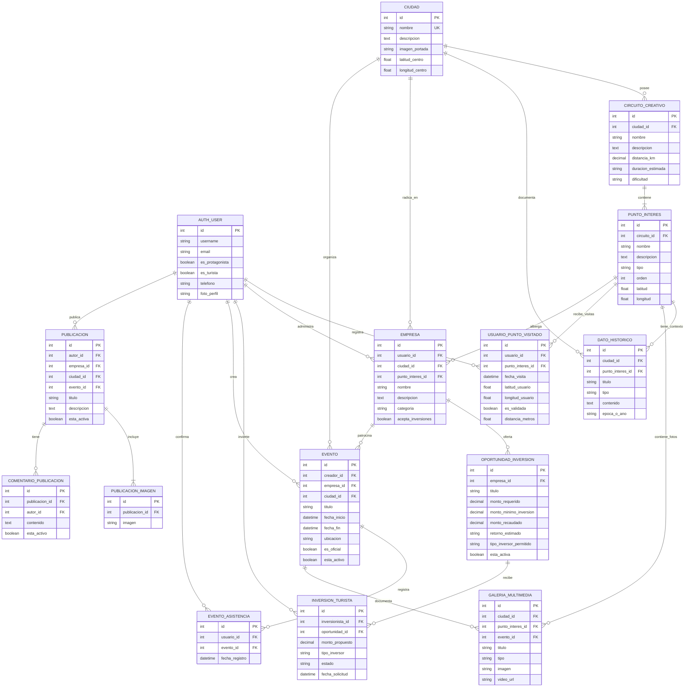
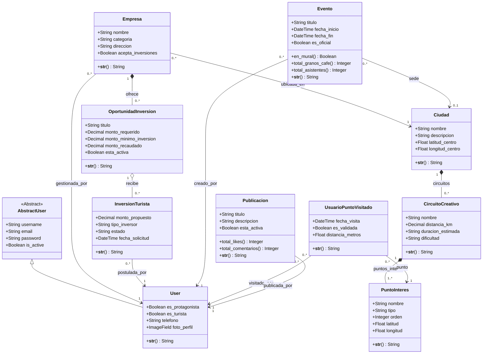
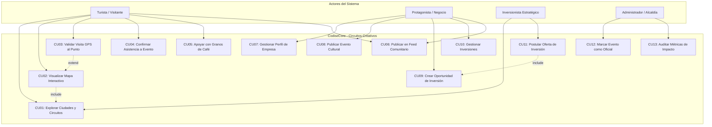
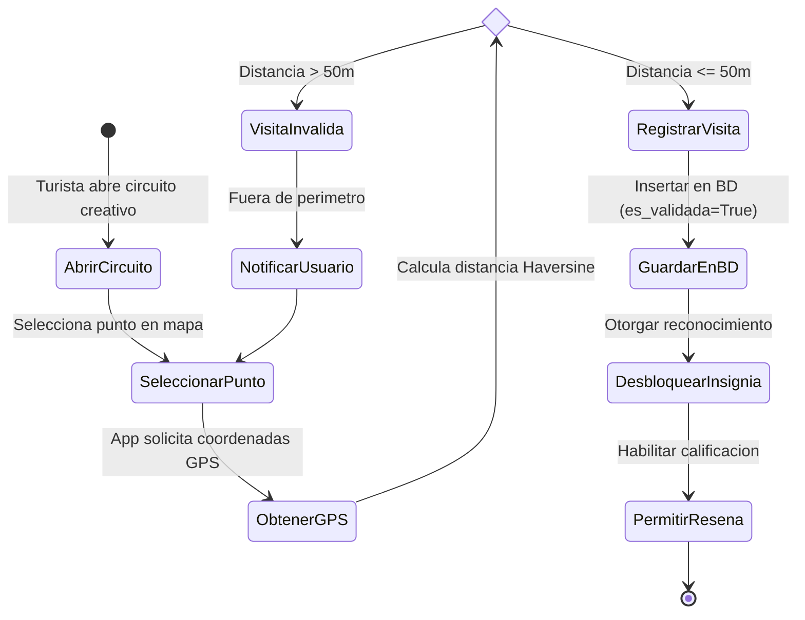

# 📐 Diagramación de Base de Datos (ER 3FN) y UML Completos
**Proyecto:** CodiseCore / Circuitos Creativos de Nicaragua  
**Framework:** Django 6.0 + Django REST Framework  
**Normalización:** Tercera Forma Normal (3FN)

---

## 📑 Tabla de Contenidos
1. [1. Diagrama Entidad-Relación Normalizado (3FN)](#1-diagrama-entidad-relación-normalizado-3fn)
2. [2. Diagrama de Clases UML](#2-diagrama-de-clases-uml)
3. [3. Diagrama de Casos de Uso UML](#3-diagrama-de-casos-de-uso-uml)
4. [4. Diagrama de Actividades UML (Flujos de Negocio)](#4-diagrama-de-actividades-uml-flujos-de-negocio)
5. [5. Guía de Exportación y Herramientas Python](#5-guía-de-exportación-y-herramientas-python)

---

## 1. Diagrama Entidad-Relación Normalizado (3FN)

El modelo de datos cumple con las reglas de la **Tercera Forma Normal (3FN)**:
- **1FN:** Atributos atómicos en todas las columnas.
- **2FN:** Dependencia total de la clave primaria.
- **3FN:** Eliminación de dependencias transitivas mediante claves foráneas explícitas.



---

## 2. Diagrama de Clases UML

Representa la estructura orientada a objetos del sistema en Django, reflejando herencias de `models.Model`, métodos de dominio, atributos tipados y propiedades calculadas (`@property`).



---

## 3. Diagrama de Casos de Uso UML



---

## 4. Diagrama de Actividades UML (Flujos de Negocio)

### Actividad A: Validación de Visita a Punto de Interés por GPS



---

## 5. Guía de Exportación y Herramientas Python

1. **Visor Interactivo:** Abre el archivo [diagramas_visor.html](file:///home/overader/Proyectos/python/Django/codisecore/diagramas_visor.html) directamente en tu navegador para interactuar con zoom, pan y descarga en formato SVG.
2. **Generación directa de archivo DOT:**
   ```bash
   python manage.py graph_models codiselu -o diagram_er.dot
   ```
