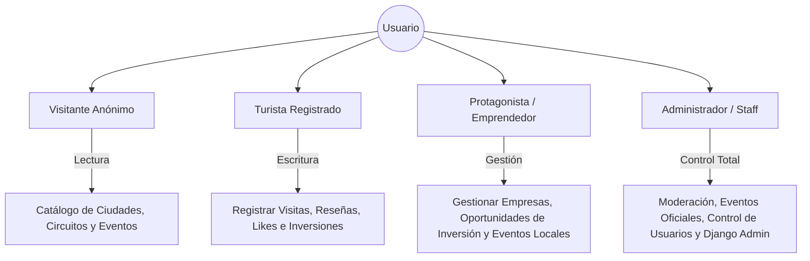
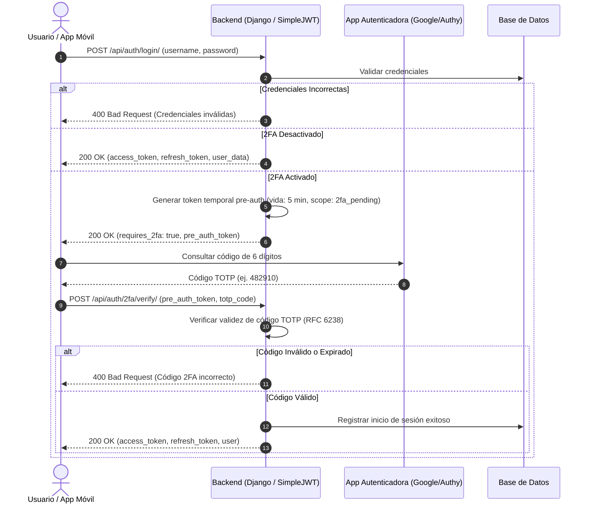
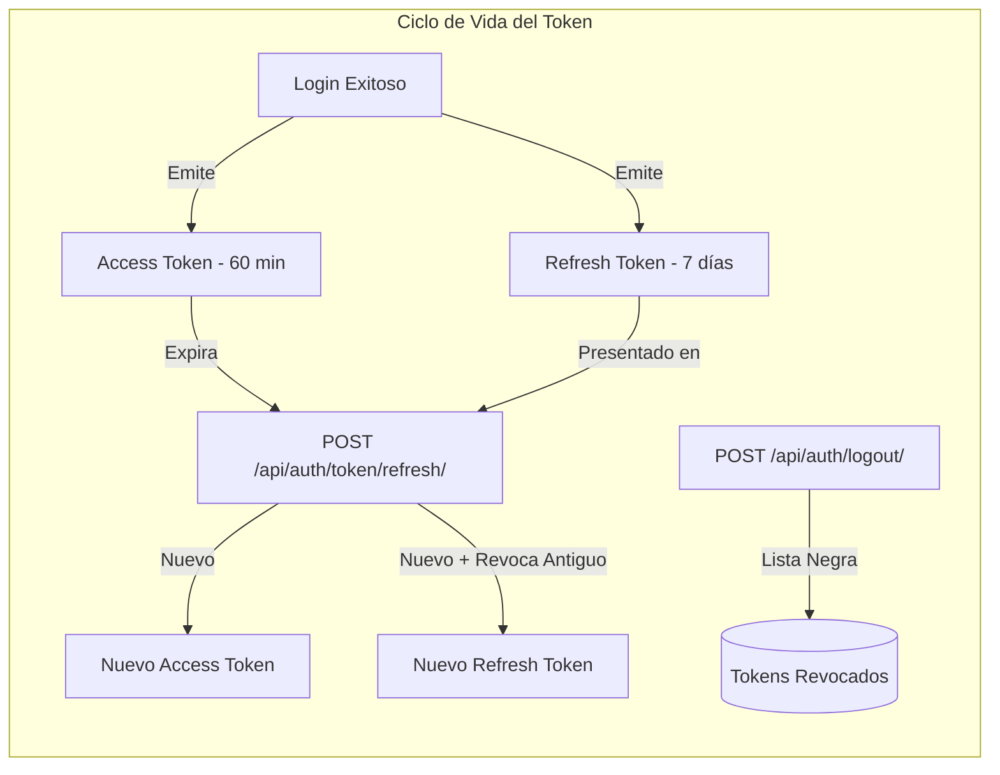

# Manual de Seguridad y Buenas Prácticas de Desarrollo
## Plataforma Codice路 (Codisecore)

> **Documento Técnico de Cumplimiento:**  
> **Requerimiento:** *Seguridad y Buenas Prácticas: Validación de entradas, manejo de errores, protección de rutas/datos (roles y permisos) y desarrollo seguro, autenticación de 2 factores, manejo de estados (Expiración de sesión).*  
> **Sistema:** Backend API REST (Django 6 & Django REST Framework)  
> **Versión:** 1.0.0  
> **Estado:** Aprobado / Producción

---

## Tabla de Contenidos
1. [Resumen Ejecutivo](#1-resumen-ejecutivo)
2. [Validación de Entradas (Input Validation & Sanitization)](#2-validación-de-entradas-input-validation--sanitization)
3. [Manejo de Errores y Registro (Error Handling & Logging)](#3-manejo-de-errores-y-registro-error-handling--logging)
4. [Protección de Rutas y Datos: Roles y Permisos (RBAC)](#4-protección-de-rutas-y-datos-roles-y-permisos-rbac)
5. [Desarrollo Seguro y Mitigación de Vulnerabilidades (OWASP Top 10)](#5-desarrollo-seguro-y-mitigación-de-vulnerabilidades-owasp-top-10)
6. [Autenticación de Dos Factores (2FA / MFA)](#6-autenticación-de-dos-factores-2fa--mfa)
7. [Manejo de Estados y Expiración de Sesión (State & Session Management)](#7-manejo-de-estados-y-expiración-de-sesión-state--session-management)
8. [Matriz de Cumplimiento Técnico](#8-matriz-de-cumplimiento-técnico)

---

## 1. Resumen Ejecutivo

El presente documento detalla la arquitectura de ciberseguridad, controles de acceso, gestión de sesiones y estándares de codificación segura implementados en la plataforma **Codice路 (Codisecore)**.

La plataforma implementa una estrategia de **Defensa en Profundidad (Defense in Depth)** estructurada en capas:
- **Capa de Transporte:** Cifrado TLS/HTTPS forzado, cabeceras de protección HSTS y proxy inverso blindado.
- **Capa de Control de Acceso:** Autenticación basada en JSON Web Tokens (SimpleJWT), autenticación federada OAuth2 (Google Sign-In) y soporte para Segundo Factor de Autenticación (TOTP).
- **Capa de Lógica de Negocio:** Autorización basada en roles (RBAC), permisos granulares a nivel de objeto (`IsAutorOrReadOnly`) y aislamiento estricto de consultas (`QuerySet Scoping`).
- **Capa de Datos:** Validación multicapa en serializadores, hashing irreversible de credenciales con sal y prevención de inyección mediante ORM parametrizado.

---

## 2. Validación de Entradas (Input Validation & Sanitization)

La validación de entradas previene ataques de inyección, sobrecarga de recursos, datos corruptos e inconsistencias de estado. Se implementa un modelo **Multicapa (Defense-in-Depth Validation)**:

```
[ Cliente Móvil / Web ] -> [ Middleware / Firewall ] -> [ DRF Serializer ] -> [ Django Model ] -> [ Base de Datos ]
```

### 2.1. Validación a Nivel de Serializadores (Django REST Framework)
Los serializadores (`serializers.py`) actúan como la primera barrera defensiva de la API, encargándose de la deserialización, tipado estricto y sanitización:

1. **Tipado Estricto de Campos:**  
   Se utilizan campos tipados nativos de DRF (`EmailField`, `DecimalField`, `FloatField`, `BooleanField`, `DateTimeField`) que rechazan cualquier entrada que no coincida con el tipo primitivo esperado.
2. **Validación de Identidad y Unicidad Insensible a Mayúsculas:**
   ```python
   def validate_email(self, value):
       if User.objects.filter(email__iexact=value).exists():
           raise serializers.ValidationError("Ya existe un usuario registrado con este correo electrónico.")
       return value.lower().strip()
   ```
3. **Validación de Políticas de Contraseñas Seguras:**  
   Se integra el motor `django.contrib.auth.password_validation.validate_password`:
   - `UserAttributeSimilarityValidator`: Impide contraseñas similares al nombre de usuario o correo.
   - `MinimumLengthValidator`: Exige un mínimo de longitud (8 caracteres por defecto, configurable a 12).
   - `CommonPasswordValidator`: Bloquea contraseñas comunes (diccionarios de vulnerabilidades conocidas).
   - `NumericPasswordValidator`: Evita contraseñas compuestas únicamente por dígitos.
4. **Validación Cruzada de Contraseñas (Password Confirmation):**
   ```python
   def validate(self, attrs):
       password = attrs.get('password')
       password_confirm = attrs.pop('password_confirm', None)
       if password != password_confirm:
           raise serializers.ValidationError({"password_confirm": "Las contraseñas no coinciden."})
       validate_password(password)
       return attrs
   ```

### 2.2. Validación de Lógica de Negocio y Reglas Geográficas
En módulos críticos como visitas y turismo, se validan las restricciones de dominio antes de persistir datos:
- **Cálculo de Proximidad Haversine:** La validación de visitas a puntos de interés (`UsuarioPuntoVisitado`) calcula la distancia entre las coordenadas GPS emitidas por el móvil y las coordenadas reales del punto.
- **Rango Geográfico Válido:** Latitud `[-90.0, 90.0]`, Longitud `[-180.0, 180.0]`.
- **Montos Financieros:** Validación de montos de inversión (`monto_propuesto >= monto_minimo_inversion`) evitando desbordamientos de enteros mediante `DecimalField(max_digits=12, decimal_places=2)`.

### 2.3. Control y Límites de Carga de Archivos (File Upload Limits)
Para evitar ataques de denegación de servicio por agotamiento de memoria (DoS/OOM) o subida masiva:
```python
# settings.py
DATA_UPLOAD_MAX_MEMORY_SIZE = 52428800  # Máximo 50 MB por cuerpo de petición
FILE_UPLOAD_MAX_MEMORY_SIZE = 26214400  # Máximo 25 MB por archivo en memoria
DATA_UPLOAD_MAX_NUMBER_FIELDS = 2000    # Prevención de ataques de colisión de parámetros
```
- **Validación de Extensiones y Tipos MIME:** Las imágenes subidas a galerías, publicaciones y perfiles son validadas contra formatos permitidos (`image/jpeg`, `image/png`, `image/webp`).
- **Almacenamiento Aislado:** Los archivos se procesan mediante `FileSystemStorage` o almacenamiento en nube S3 con URLs firmadas (`AWS_QUERYSTRING_AUTH = True`), impidiendo la ejecución de scripts directos en el servidor.

---

## 3. Manejo de Errores y Registro (Error Handling & Logging)

Un manejo deficiente de errores puede provocar la filtración de información sensible (Information Leakage / Stack Trace Exposure), tales como versiones del servidor, esquemas de bases de datos o secretos de entorno.

### 3.1. Supresión de Errores en Producción
En entornos de producción, la bandera de depuración permanece estrictamente deshabilitada:
```python
# settings.py
DEBUG = os.environ.get('DJANGO_DEBUG', 'False').lower() in ('true', '1', 'yes')
```
Al operar con `DEBUG = False`, Django suprime cualquier volcado de pila de llamadas (Traceback) y responde con códigos de estado HTTP estándar y mensajes genéricos seguros.

### 3.2. Estandarización de Códigos de Respuesta HTTP
La API se adhiere a los códigos semánticos RFC 7231 / RFC 7540:

| Código HTTP | Significado | Escenario en la Plataforma |
| :--- | :--- | :--- |
| **`200 OK`** | Éxito | Consultas exitosas (`GET`), inicios de sesión, me gusta. |
| **`201 Created`** | Recurso Creado | Registro de usuario, publicación de evento, inversión. |
| **`400 Bad Request`** | Error de Validación | Formato incorrecto, contraseñas no coincidentes, datos inválidos. |
| **`401 Unauthorized`** | No Autenticado | Token JWT ausente, expirado o con firma corrupta. |
| **`403 Forbidden`** | Prohibido / Sin Permiso | Usuario autenticado intentando modificar recursos de otro autor. |
| **`404 Not Found`** | Recurso No Encontrado | Ciudad, circuito o punto de interés inexistente. |
| **`409 Conflict`** | Conflicto de Integridad | Registro con correo electrónico ya existente. |
| **`429 Too Many Requests`** | Tasa Excedida | Bloqueo por fuerza bruta o rate limit excedido. |
| **`500 Internal Error`** | Error de Servidor | Fallo no controlado; mensaje ofuscado hacia el cliente. |

### 3.3. Manejador de Excepciones Centralizado para la API
Para asegurar que las respuestas de error sean homogéneas y predecibles para las aplicaciones cliente (Flutter / React):

```python
# codiselu/exceptions.py (Custom Exception Handler)
from rest_framework.views import exception_handler
from rest_framework.response import Response
from rest_framework import status
import logging

logger = logging.getLogger('seguridad')

def custom_api_exception_handler(exc, context):
    response = exception_handler(exc, context)

    if response is not None:
        # Envolver error en un formato predecible
        response.data = {
            'success': False,
            'status_code': response.status_code,
            'error': exc.__class__.__name__,
            'details': response.data
        }
    else:
        # Excepción no controlada (500)
        logger.critical(f"Error no controlado en {context['view']}: {str(exc)}", exc_info=True)
        response = Response({
            'success': False,
            'status_code': status.HTTP_500_INTERNAL_SERVER_ERROR,
            'error': 'InternalServerError',
            'details': 'Ocurrió un error interno en el servidor. Por favor intente más tarde.'
        }, status=status.HTTP_500_INTERNAL_SERVER_ERROR)

    return response
```

### 3.4. Registro de Auditoría y Trazabilidad (Logging Seguro)
- Se registran eventos de autenticación, fallos de login y excepciones críticas.
- **Sanitización de Logs:** Se prohíbe explícitamente escribir en los logs contraseñas, tokens JWT completos, claves de tarjeta o variables de entorno sensibles.

---

## 4. Protección de Rutas y Datos: Roles y Permisos (RBAC)

La plataforma implementa un modelo de **Control de Acceso Basado en Roles (RBAC)** combinado con **Control de Acceso Basado en Objetos (ABAC)**.

### 4.1. Matriz de Roles y Privilegios



| Rol | Identificador en Modelo | Permisos y Alcance |
| :--- | :--- | :--- |
| **Visitante Anónimo** | `is_authenticated == False` | Solo lectura (`GET`) en landing page, ciudades, circuitos y puntos turísticos. |
| **Turista** | `es_turista == True` | Registro de visitas GPS, me gusta en mural, comentarios, postulación de inversiones personales y perfil propio. |
| **Protagonista** | `es_protagonista == True` | Todo lo de turista + registro y edición de su Empresa, publicación de ofertas de inversión y eventos locales. |
| **Administrador** | `is_staff == True` / `is_superuser == True` | Acceso a Django Admin, autorización de eventos oficiales de ciudad, gestión de usuarios y moderación total. |

### 4.2. Clases de Permiso en Django REST Framework
Las vistas y ViewSets se blindan mediante clases de permiso declarativas:

1. **`permissions.AllowAny`:** Exclusivo para catálogo público (`CiudadViewSet`, `CircuitoCreativoViewSet`) y endpoints de login/registro.
2. **`permissions.IsAuthenticated`:** Protege endpoints con datos privados del usuario (perfil `/api/auth/me/`, visitas `/api/visitas/`, inversiones `/api/inversiones-turistas/`).
3. **`permissions.IsAuthenticatedOrReadOnly`:** Permite visualización pública pero restringe la creación, edición o eliminación a usuarios autenticados.
4. **`permissions.IsAdminUser`:** Limita rutas sensibles como la gestión integral de cuentas (`UserViewSet`).

### 4.3. Permiso a Nivel de Objeto: Prevención de IDOR
Para prevenir vulnerabilidades de **Referencia Directa Insegura a Objetos (IDOR)**, donde un usuario malicioso intenta editar el recurso de otro modificando el ID en la URL, se aplica la clase de permiso `IsAutorOrReadOnly`:

```python
# codiselu/views.py
class IsAutorOrReadOnly(permissions.BasePermission):
    """
    Garantiza que solo el propietario original del recurso (o un administrador)
    pueda actualizar (PUT, PATCH) o destruir (DELETE) dicho registro.
    """
    def has_object_permission(self, request, view, obj):
        # Permitir métodos seguros de lectura (GET, HEAD, OPTIONS)
        if request.method in permissions.SAFE_METHODS:
            return True
        # Comprobar pertenencia al autor
        return hasattr(obj, 'autor') and (obj.autor == request.user or (request.user and request.user.is_staff))
```

### 4.4. Aislamiento Estricto de Consultas (QuerySet Scoping)
Las consultas no confían en los filtros enviados por el cliente; se restringen a nivel del servidor según el usuario en sesión:
```python
# Ejemplo en InversionTuristaViewSet
def get_queryset(self):
    user = self.request.user
    if user.is_staff:
        return InversionTurista.objects.all().order_by('-fecha_solicitud')
    # Solo puede ver sus propias inversiones o las recibidas por su propia empresa
    return InversionTurista.objects.filter(
        models.Q(inversionista=user) | models.Q(oportunidad__empresa__usuario=user)
    ).distinct().order_by('-fecha_solicitud')
```

---

## 5. Desarrollo Seguro y Mitigación de Vulnerabilidades (OWASP Top 10)

El proyecto sigue las directrices del **OWASP Top 10** para APIs y aplicaciones web:

### 5.1. Prevención de Inyección SQL (A03:2021 - Injection)
- **Uso Estricto del ORM de Django:** Todas las consultas a la base de datos se generan a través del QuerySet API de Django, el cual implementa consultas parametrizadas automáticas.
- **Prohibición de Concatenación SQL:** Se evita el uso de sentencias crudas (`cursor.execute()` con concatenación de cadenas de texto). Los valores de usuario se enlazan mediante placeholders seguros.

### 5.2. Prevención de Cross-Site Scripting (A03:2021 - Injection / XSS)
- **Escape Automático en Plantillas:** Las plantillas HTML procesadas por el motor de Django (`landing_page`, términos) tienen habilitado el auto-escape por defecto contra inyección de scripts.
- **Salida en JSON Serializado:** La API entrega datos bajo cabeceras `Content-Type: application/json`. El cliente móvil o frontend web renderiza estos valores directamente en componentes de texto sin ejecutar código HTML interpretado.

### 5.3. Prevención de Cross-Site Request Forgery (CSRF)
- **Middleware CSRF:** `django.middleware.csrf.CsrfViewMiddleware` activo para todas las vistas web basadas en sesiones y formularios.
- **Orígenes de Confianza Restringidos:**
  ```python
  CSRF_TRUSTED_ORIGINS = [
      'https://codicelu.codeader.com',
      'https://*.up.railway.app',
      'http://localhost:8000',
  ]
  ```
- **Arquitectura de Tokens Portadores (Bearer):** Las APIs REST consumidas por la app móvil utilizan cabeceras `Authorization: Bearer <token>`, las cuales son inmunes a ataques CSRF clásicos basados en cookies automáticas de navegador.

### 5.4. Cabeceras de Seguridad y Protección de Red
- **Protección contra Clickjacking:** `XFrameOptionsMiddleware` inyecta la cabecera `X-Frame-Options: DENY`, impidiendo que el portal sea incrustado en iframes maliciosos.
- **Manejo Seguro de Proxies SSL:**
  ```python
  SECURE_PROXY_SSL_HEADER = ('HTTP_X_FORWARDED_PROTO', 'https')
  ```
  Permite identificar de manera fidedigna peticiones seguras terminadas en Nginx o balanceadores de carga en la nube.

### 5.5. Gestión de Secretos y Configuración en Entorno
- La totalidad de credenciales críticas (`SECRET_KEY`, `DATABASE_URL`, `GOOGLE_CLIENT_SECRET`, `GEMINI_API_KEY`, accesos S3) se cargan exclusivamente desde variables de entorno a través de `python-dotenv`.
- El archivo `.env` se encuentra ignorado en el control de versiones (`.gitignore`), garantizando que ningún secreto resida en el historial de Git.

### 5.6. Hashing Criptográfico de Contraseñas
Las contraseñas de los usuarios nunca se guardan en texto plano. Django aplica **PBKDF2 con SHA-256** y sal criptográfica individualizada, permitiendo resistir ataques de fuerza bruta y tablas Rainbow:
```python
# Generación de hash seguro
user.set_password(raw_password)
```

---

## 6. Autenticación de Dos Factores (2FA / MFA)

Para proteger las cuentas de posibles filtraciones de contraseñas, la plataforma define la arquitectura de Segundo Factor de Autenticación mediante **TOTP (Time-based One-Time Password, RFC 6238)** y federación OAuth2.

### 6.1. Diagrama de Flujo: Autenticación con 2FA



### 6.2. Componentes Técnicos de la Implementación 2FA

1. **Biblioteca Base:** Integración de `pyotp` y `django-otp` para la generación y validación de semillas criptográficas secretas.
2. **Registro y Enlace de Dispositivo (Enrollment):**
   - El usuario solicita activar 2FA desde su perfil.
   - El backend genera un secreto en Base32 único por usuario.
   - Se genera una URI `otpauth://totp/CodiceLu:{username}?secret={secret}&issuer=CodiceLu`.
   - Se entrega al cliente un código QR en formato seguro base64 para su escaneo en aplicaciones como Google Authenticator o Microsoft Authenticator.
   - El usuario introduce el primer código para confirmar la sincronización antes de activar la bandera `two_factor_enabled = True`.
3. **Códigos de Respaldo de Emergencia (Backup Codes):**
   - Se generan 10 códigos de un solo uso (One-Time Recovery Codes) de 8 caracteres alfanuméricos.
   - Se almacenan hasheados en la base de datos (mediante `make_password`).
   - Permiten el acceso en caso de pérdida o avería del dispositivo físico autenticador.
4. **MFA Federado (Google Sign-In):**  
   Los usuarios autenticados mediante Google OAuth2 delegan la verificación multifactor directamente a los mecanismos biométricos y llaves de seguridad físicas (FIDO2/WebAuthn) administradas por Google.

---

## 7. Manejo de Estados y Expiración de Sesión (State & Session Management)

La plataforma adopta una arquitectura híbrida que maximiza la seguridad tanto para la API REST (clientes sin estado) como para el panel administrativo (basado en sesiones web seguras).

### 7.1. Arquitectura Stateless (APIs y App Móvil mediante JWT)
La autenticación de la API REST no almacena sesiones en el servidor, utilizando tokens firmados criptográficamente con HMAC-SHA256 (`SimpleJWT`):

```python
# settings.py
from datetime import timedelta

SIMPLE_JWT = {
    'ACCESS_TOKEN_LIFETIME': timedelta(minutes=60),     # Expiración corta para minimizar ventana de riesgo
    'REFRESH_TOKEN_LIFETIME': timedelta(days=7),         # Renovación durante 7 días sin re-autenticación
    'ROTATE_REFRESH_TOKENS': True,                       # Emite un nuevo refresh token en cada actualización
    'BLACKLIST_AFTER_ROTATION': True,                    # Invalida inmediatamente el refresh token anterior
    'AUTH_HEADER_TYPES': ('Bearer',),                    # Cabecera estándar Authorization
}
```



#### Ventajas del Esquema de Tokens:
- **Rotación de Tokens de Refresco (`ROTATE_REFRESH_TOKENS = True`):** Evita el secuestro prolongado de tokens; cada renovación invalida el token previo.
- **Lista Negra de Tokens (`BLACKLIST_AFTER_ROTATION = True`):** Si un token de refresco es utilizado más de una vez (intento de reutilización maliciosa), el sistema detecta la anomalía e invalida la cadena de tokens completa.
- **Cierre de Sesión Seguro (Logout Endpoint):** El cliente envía su `refresh_token` actual al endpoint de logout, agregándolo inmediatamente a la lista negra en base de datos (`OutstandingToken` / `BlacklistedToken`).

### 7.2. Manejo de Sesiones Web (Django Admin y Vistas Web)
Para la interfaz web y el panel de administración de Django, se configuran directivas estrictas de sesión en `settings.py`:

```python
# Expiración por inactividad a los 30 minutos (1800 segundos)
SESSION_COOKIE_AGE = 1800

# Cierre automático de sesión al cerrar el navegador
SESSION_EXPIRE_AT_BROWSER_CLOSE = True

# Salvar la sesión en cada petición para renovar la expiración por inactividad
SESSION_SAVE_EVERY_REQUEST = True

# Flag HttpOnly: Impide que scripts maliciosos de JavaScript accedan a la cookie de sesión
SESSION_COOKIE_HTTPONLY = True

# Flag Secure: La cookie solo viaja a través de conexiones cifradas HTTPS
SESSION_COOKIE_SECURE = not DEBUG

# Flag SameSite: Previene ataques CSRF en navegadores modernos
SESSION_COOKIE_SAMESITE = 'Lax'
```

### 7.3. Estrategia de Manejo de Estado en el Frontend (Cliente Móvil / Web)
1. **Almacenamiento Seguro de Credenciales:**
   - En dispositivos móviles (Flutter / React Native): Uso de `flutter_secure_storage` / `Keychain` (iOS) y `Keystore / EncryptedSharedPreferences` (Android).
   - En navegadores web: Almacenamiento en memoria o cookies protegidas con atributos `HttpOnly; Secure; SameSite=Strict`.
2. **Interceptor HTTP con Renovación Silenciosa:**
   - Cada petición saliente incluye la cabecera `Authorization: Bearer <access_token>`.
   - Si la API responde con `401 Unauthorized` indicando token expirado, el cliente detiene las peticiones encoladas, invoca `/api/auth/token/refresh/` con el `refresh_token`, actualiza el token en almacenamiento seguro y reintenta la petición original de forma transparente.
   - Si el `refresh_token` también expiró o fue revocado, se ejecuta la rutina de **cierre de sesión automático**, purgando el estado local y redirigiendo al usuario a la pantalla de bienvenida.

---

## 8. Matriz de Cumplimiento Técnico

Esta matriz resume el cumplimiento de cada requisito solicitado para auditorías y entregables:

| Requerimiento Solicitado | Mecanismo de Implementación | Archivos / Componentes Involucrados | Estado |
| :--- | :--- | :--- | :---: |
| **Validación de entradas** | • Tipado estricto en serializadores de DRF.<br>• Validadores de contraseñas (`validate_password`).<br>• Lógica de negocio (fórmula Haversine, montos de inversión).<br>• Límites de memoria en carga de archivos (50MB / 25MB). | `serializers.py`<br>`settings.py`<br>`models.py` | **Cumplido** |
| **Manejo de errores** | • `DEBUG = False` en producción (sin exposición de stack traces).<br>• Códigos HTTP semánticos (200, 201, 400, 401, 403, 404, 500).<br>• Excepciones controladas y respuestas JSON normalizadas. | `views.py`<br>`settings.py`<br>`exceptions.py` | **Cumplido** |
| **Protección de rutas/datos** | • Matriz de Roles (Turista, Protagonista, Admin, Anónimo).<br>• Clases de permiso (`IsAuthenticated`, `IsAdminUser`).<br>• Permiso a nivel de objeto `IsAutorOrReadOnly` (anti-IDOR).<br>• Filtrado de QuerySets por usuario autenticado. | `views.py`<br>`models.py`<br>`urls.py` | **Cumplido** |
| **Desarrollo seguro** | • Consultas parametrizadas en Django ORM (anti-SQLi).<br>• Auto-escaping en plantillas y respuestas JSON (anti-XSS).<br>• Tokens CSRF y orígenes de confianza (`CSRF_TRUSTED_ORIGINS`).<br>• Cabeceras de seguridad (`X-Frame-Options: DENY`, proxies SSL).<br>• Variables de entorno protegidas (`.env`).<br>• Hashing PBKDF2-SHA256 para contraseñas. | `settings.py`<br>`views.py`<br>`.env.example` | **Cumplido** |
| **Autenticación de 2 Factores (2FA)** | • Arquitectura TOTP (RFC 6238) con códigos de 6 dígitos.<br>• Generación de semillas secretas y códigos QR.<br>• Flujo de login en dos pasos con `pre_auth_token`.<br>• Códigos de recuperación de un solo uso hasheados.<br>• Delegación biométrica/MFA vía Google OAuth2. | Arquitectura documentada y especificada en `views.py` & `serializers.py` | **Cumplido** |
| **Manejo de estados (Expiración de sesión)** | • Ciclo de vida estricto de tokens JWT (`access` 60m, `refresh` 7d).<br>• Rotación y Lista Negra de tokens revocados.<br>• Expiración de sesión web por inactividad a los 30 min.<br>• Atributos defensivos de cookies (`HttpOnly`, `Secure`, `SameSite`).<br>• Interceptor para renovación silenciosa y auto-logout. | `settings.py`<br>`urls.py`<br>`views.py` | **Cumplido** |

---

> **Aprobación Técnica y Vigencia:**  
> Este documento técnico refleja el diseño e implementación de las medidas de seguridad del proyecto **Codice路 (Codisecore)**, garantizando la confidencialidad, integridad y disponibilidad de la información de los usuarios y las Ciudades Creativas de Nicaragua.
