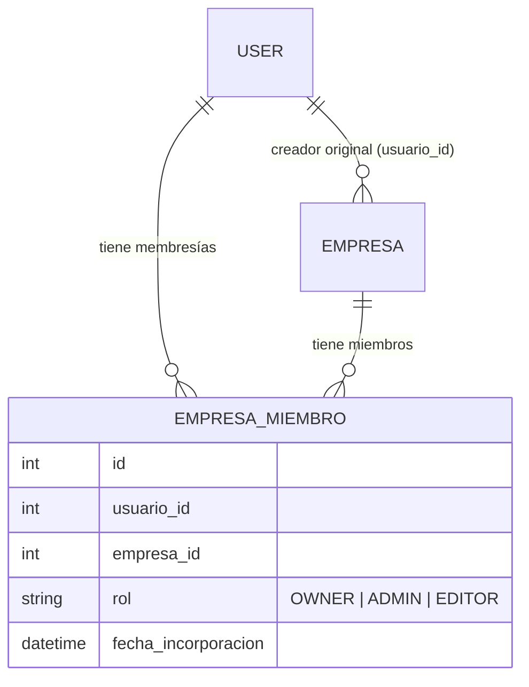

# 6. Gestión de Empresas, Destinos y Conexión de Usuarios (Multi-Empresa)

El sistema cuenta con una arquitectura **Multi-Empresa** que conecta a los usuarios de la plataforma con los emprendimientos, talleres, hoteles y destinos turísticos locales. Permite a los artesanos y emprendedores (**usuarios protagonistas**) colaborar en equipo, delegar roles administrativos y publicar contenido oficial en nombre de su negocio.

---

## 6.1 Arquitectura de la Conexión Usuario - Empresa

La relación entre los usuarios y las empresas se modela mediante una estructura de **membresías colaborativas** (`EmpresaMiembro`):



### Principios Fundamentales
1. **Un usuario puede pertenecer a múltiples empresas:** Un mismo artesano o gestor puede ser Propietario (`OWNER`) de su taller y Administrador (`ADMIN`) de una cooperativa gastronómica o destino turístico.
2. **Una empresa puede tener múltiples miembros:** Permite a una empresa turística tener un equipo de trabajo (dueño, administradores y editores de contenido).
3. **Condición de Protagonista Automática:** Cuando un usuario crea una empresa o es invitado como miembro de una, el sistema actualiza de forma automática su perfil a `es_protagonista: true`.

---

## 6.2 Roles de Membresía y Niveles de Permiso

| Rol | Identificador | Capacidades y Permisos |
| :--- | :--- | :--- |
| **Propietario** | `OWNER` | **Control total:** Modificar datos de la empresa, eliminar la empresa, invitar y expulsar administradores/editores, publicar eventos y publicaciones oficiales, y postular oportunidades de inversión. Asignado automáticamente al creador original. |
| **Administrador** | `ADMIN` | **Gestión operativa y de equipo:** Invitar o modificar roles de miembros (hasta nivel `ADMIN`), editar información comercial de la empresa, crear eventos oficiales y gestionar publicaciones de la empresa. |
| **Editor** | `EDITOR` | **Creación de contenido:** Publicar fotos, noticias y eventos en nombre de la empresa. No puede modificar datos fiscales/básicos de la empresa ni gestionar a otros miembros. |

---

## 6.3 Selector de Perfiles: Mis Empresas (`GET /api/empresas/mis_empresas/`)

Este endpoint está especialmente diseñado para la interfaz de la **App Móvil y Web Frontend**. Permite renderizar un menú desplegable de "Cambiar de Perfil" (ejemplo: alternar entre *Perfil Personal de Carlos* y *Perfil de Empresa: Artesanías Monimbó*).

* **Endpoint:** `GET /api/empresas/mis_empresas/`
* **Headers:** `Authorization: Bearer <JWT_TOKEN>`
* **Respuesta Exitosa (`200 OK`):**

```json
[
  {
    "id": 1,
    "nombre": "Artesanías Monimbó",
    "descripcion": "Taller artesanal especializado en hamacas y cerámica tradicional.",
    "categoria": "Taller",
    "direccion": "Barrio Monimbó, contiguo a la Plaza de San Jerónimo",
    "telefono_contacto": "+50588888888",
    "email_contacto": "contacto@artesaniasmonimbo.com",
    "sitio_web": "https://artesaniasmonimbo.com",
    "imagen_portada": "http://localhost:8000/media/empresas/portadas/monimbo.jpg",
    "ciudad": 5,
    "ciudad_nombre": "Masaya",
    "latitud": 11.9744,
    "longitud": -86.0942,
    "acepta_inversiones": true,
    "rol": "OWNER",
    "fecha_incorporacion": "2026-08-08T01:30:00Z",
    "fecha_creacion": "2026-08-08T01:30:00Z"
  },
  {
    "id": 4,
    "nombre": "Hostal Colonial Granada",
    "descripcion": "Alojamiento boutique en el centro histórico.",
    "categoria": "Hospedaje",
    "ciudad": 2,
    "ciudad_nombre": "Granada",
    "rol": "EDITOR",
    "fecha_incorporacion": "2026-09-12T14:20:00Z",
    "fecha_creacion": "2026-07-01T10:00:00Z"
  }
]
```

---

## 6.4 Gestión del Equipo de Trabajo (`/api/empresas/{id}/miembros/`)

### A. Listar Miembros de la Empresa (`GET`)
Permite consultar el directorio de colaboradores de la empresa.

* **Endpoint:** `GET /api/empresas/{id}/miembros/`
* **Headers:** `Authorization: Bearer <JWT_TOKEN>`
* **Respuesta Exitosa (`200 OK`):**

```json
[
  {
    "id": 1,
    "empresa": 1,
    "usuario": 3,
    "usuario_username": "protagonista_monimbo",
    "usuario_nombre": "Carlos Mendoza",
    "usuario_foto_perfil": "http://localhost:8000/media/perfiles/carlos.jpg",
    "rol": "OWNER",
    "fecha_incorporacion": "2026-08-08T01:30:00Z"
  },
  {
    "id": 2,
    "empresa": 1,
    "usuario": 9,
    "usuario_username": "lucia_marketing",
    "usuario_nombre": "Lucía Morales",
    "usuario_foto_perfil": null,
    "rol": "EDITOR",
    "fecha_incorporacion": "2026-09-15T09:00:00Z"
  }
]
```

### B. Invitar o Actualizar Rol de un Miembro (`POST`)
Permite al Propietario (`OWNER`) o Administrador (`ADMIN`) de la empresa añadir a un colaborador existente o actualizar sus permisos.

* **Endpoint:** `POST /api/empresas/{id}/miembros/`
* **Headers:**
  * `Content-Type: application/json`
  * `Authorization: Bearer <JWT_TOKEN>`
* **Body (JSON):**

Se puede identificar al colaborador mediante su `usuario_id` o su `username`:

```json
{
  "username": "lucia_marketing",
  "rol": "EDITOR"
}
```
*(Valores aceptados para `rol`: `"OWNER"`, `"ADMIN"`, `"EDITOR"`).*

* **Respuesta Exitosa (`201 Created` o `200 OK`):**
```json
{
  "id": 2,
  "empresa": 1,
  "usuario": 9,
  "usuario_username": "lucia_marketing",
  "usuario_nombre": "Lucía Morales",
  "usuario_foto_perfil": null,
  "rol": "EDITOR",
  "fecha_incorporacion": "2026-09-15T09:00:00Z"
}
```

---

## 6.5 Cambio de Contexto con el Encabezado `X-Company-Id`

Para permitir que un usuario autenticado actúe **a nombre de una empresa** (por ejemplo, al publicar fotos en el feed o al crear un evento de agenda), la API implementa el encabezado HTTP:

```http
X-Company-Id: 1
```

### ¿Cómo opera el backend al recibir `X-Company-Id`?

1. **Sin el encabezado `X-Company-Id`:**
   * La acción se procesa como **Perfil Personal / Turista**.
   * Al crear una publicación, `tipo_autor = 'USUARIO'`. El nombre y avatar visibles en el feed serán los personales del usuario.
2. **Con el encabezado `X-Company-Id: <ID>`:**
   * El backend verifica que el usuario autenticado posea una membresía activa (`OWNER`, `ADMIN` o `EDITOR`) en dicha empresa.
   * Si no pertenece a la empresa, rechaza la solicitud de inmediato con un error `403 Forbidden` (`PermissionDenied`).
   * Si es miembro válido, ejecuta la acción a nombre de la empresa:
     * En publicaciones: `tipo_autor = 'EMPRESA'`, asociando `empresa = <ID>`. El autor visible en el feed será el nombre y logo de la empresa.
     * En eventos: el evento queda directamente vinculado a la empresa.
     * En permisos de edición: cualquier miembro autorizado de la empresa podrá posteriormente editar o moderar ese contenido.

---

## 6.6 Registrar Empresa o Destino (`POST /api/empresas/`)

Crea una nueva empresa o destino turístico. El usuario que realiza la petición queda asignado de forma inmediata como **`OWNER`** y adquiere automáticamente el estado `es_protagonista: true`.

* **Endpoint:** `POST /api/empresas/`
* **Headers:**
  * `Content-Type: application/json` *(o `multipart/form-data` con `imagen_portada`)*
  * `Authorization: Bearer <JWT_TOKEN>`

### Parámetros del Body (JSON)

| Campo | Tipo | Requerido | Descripción |
| :--- | :--- | :---: | :--- |
| `nombre` | `String` | **Sí** | Nombre comercial de la empresa o taller. |
| `descripcion` | `String` | **Sí** | Reseña de actividades, especialidad o productos. |
| `categoria` | `String` | **Sí** | `Taller`, `Gastronomia`, `Hospedaje`, `Destino`, `Servicios`, `Otro`. |
| `ciudad` | `Integer` | **Sí** | ID de la Ciudad Creativa donde opera. |
| `punto_interes` | `Integer` | No | ID del punto de interés turístico cercano (opcional/desacoplado). |
| `direccion` | `String` | No | Dirección física o referencia local. |
| `telefono_contacto` | `String` | No | Teléfono fijo o móvil de contacto. |
| `numero_whatsapp` | `String` | No | Número internacional de WhatsApp (ej: `+50588888888`). |
| `email_contacto` | `String` | No | Correo electrónico comercial. |
| `sitio_web` | `String` | No | Enlace a sitio web o red social. |
| `latitud` | `Float` | No | Coordenada GPS latitud. |
| `longitud` | `Float` | No | Coordenada GPS longitud. |
| `acepta_inversiones` | `Boolean` | No | Indica si acepta ofertas de inversión (defecto: `false`). |
| `tiene_publicidad` | `Boolean` | No | Indica si cuenta con pauta publicitaria pagada para circuitos. |
| `fecha_fin_publicidad` | `Date` | No | Fecha límite de la pauta publicitaria (`YYYY-MM-DD`). |
| `circuitos` | `Array[Int]` | No | IDs de Circuitos donde se asigna explícitamente como patrocinador. |
| `imagen_portada` | `File` | No | Archivo de fotografía de portada. |

### Ejemplo de Petición
```json
{
  "nombre": "Artesanías Monimbó",
  "descripcion": "Taller artesanal especializado en la confección de hamacas y cerámica tradicional.",
  "categoria": "Taller",
  "ciudad": 5,
  "direccion": "Barrio Monimbó, contiguo a la Plaza de San Jerónimo",
  "telefono_contacto": "+50588888888",
  "numero_whatsapp": "+50588888888",
  "email_contacto": "contacto@artesaniasmonimbo.com",
  "sitio_web": "https://artesaniasmonimbo.com",
  "latitud": 11.9744,
  "longitud": -86.0942,
  "acepta_inversiones": true,
  "tiene_publicidad": true,
  "fecha_fin_publicidad": "2026-12-31"
}
```

---

## 6.7 Listar Directorio Público de Empresas (`GET /api/empresas/`)

Endpoint público para consultar empresas y destinos con filtros por query params:

```bash
# Directorio completo
GET /api/empresas/

# Filtrar empresas que aceptan inversores
GET /api/empresas/?acepta_inversiones=true

# Filtrar empresas por Ciudad Creativa (ej. Masaya ID 5)
GET /api/empresas/?ciudad=5
```

---

## 6.8 Empresas en Circuitos Turísticos (Proximidad vs. Publicidad)

Las empresas están **disociadas de los puntos de interés** patrimoniales y se incorporan dinámicamente a los circuitos turísticos bajo dos criterios:

1. **Empresas Orgánicas en Ruta (Por Defecto):**
   * Aquellas ubicadas a **$\le$ 800 metros** de cualquiera de los puntos de interés del circuito.
   * Se presentan con `es_patrocinada: false` y `en_ruta: true`.
2. **Empresas Patrocinadas (Con Pago de Publicidad):**
   * Aquellas con `tiene_publicidad = true` vigente o vinculadas al circuito, incluso si están más retiradas (radio ampliado de hasta **5.000 metros**).
   * Se presentan con `es_patrocinada: true` y aparecen con máxima prioridad al inicio del listado en la app móvil.
3. **Contacto Directo por WhatsApp:**
   * La API entrega el campo computado `link_whatsapp` (ejemplo: `https://wa.me/50588888888`) para abrir el chat con el artesano o negocio con un solo toque.

### Endpoint Dedicado: Consultar Empresas de un Circuito
* **Endpoint:** `GET /api/circuitos/{id}/empresas/`
* **Parámetros Opcionales (Query Params):**
  * `radio_metros`: Distancia máxima para comercios orgánicos en ruta (defecto: `800`).
  * `radio_patrocinado_metros`: Distancia máxima para comercios con publicidad (defecto: `5000`).
* **Respuesta Exitosa (`200 OK`):**
```json
[
  {
    "id": 4,
    "nombre": "Restaurante El Portal Colonial",
    "categoria": "Gastronomia",
    "direccion": "Costado norte de la plaza",
    "telefono_contacto": "+50588882222",
    "numero_whatsapp": "+50588882222",
    "link_whatsapp": "https://wa.me/50588882222",
    "imagen_portada": "http://localhost:8000/media/empresas/portal.jpg",
    "latitud": 12.4450,
    "longitud": -86.8900,
    "es_patrocinada": true,
    "en_ruta": false,
    "distancia_metros": 1450.0,
    "punto_cercano_nombre": "Catedral de León"
  },
  {
    "id": 1,
    "nombre": "Taller El Poeta",
    "categoria": "Taller",
    "direccion": "Calle peatonal",
    "telefono_contacto": "+50588881111",
    "numero_whatsapp": "+50588881111",
    "link_whatsapp": "https://wa.me/50588881111",
    "es_patrocinada": false,
    "en_ruta": true,
    "distancia_metros": 45.2,
    "punto_cercano_nombre": "Catedral de León"
  }
]
```

---

[⬅ Visitas y Geolocalización](05-visitas-geolocalizacion.md) | [Volver al Índice](README.md) | [Siguiente: Módulo de Inversiones ➡](07-modulo-inversiones.md)
